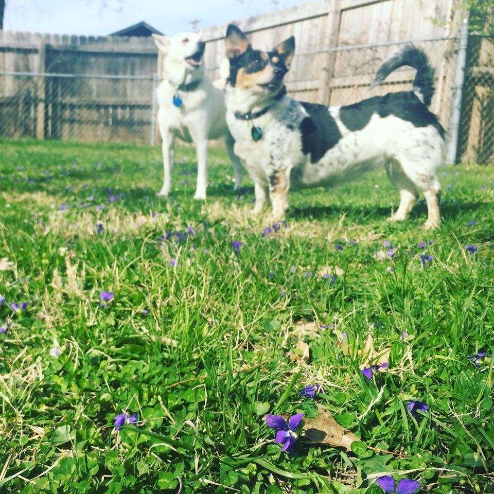
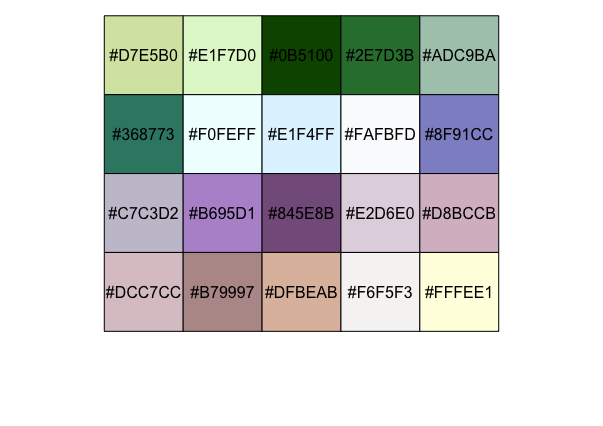

# cuttlefish 

`cuttlefish` is a package that allows you to extract the distinct colors from images.

## Installation

```splus
# install dev version (the only version currently)
devtools::install_github("jcbain/cuttlefish")

# load cuttlefish
library(rtweet)
```

## Usage

Imagine you have the following image and you thought, "Wow, I like those colors! I would like to make a color palette out of that." 



Simple! How about a palette of 20 colors...

```splus
cols <- create_palette("path/to/image.png", n=20)
cols
 [1] "#D7E5B0" "#E1F7D0" "#0B5100" "#2E7D3B" "#ADC9BA" "#368773" "#F0FEFF" "#E1F4FF" "#FAFBFD" "#8F91CC"
[11] "#C7C3D2" "#B695D1" "#845E8B" "#E2D6E0" "#D8BCCB" "#DCC7CC" "#B79997" "#DFBEAB" "#F6F5F3" "#FFFEE1"
```

And how about taking a look at the color palette with the `scales` package.

```splus
scales::show_col(cols)
```



